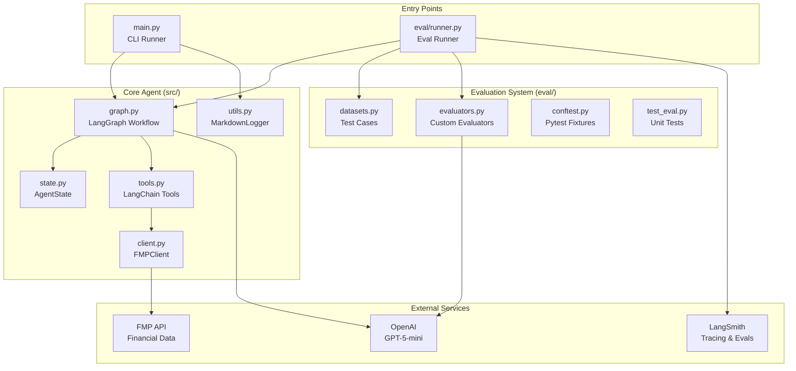
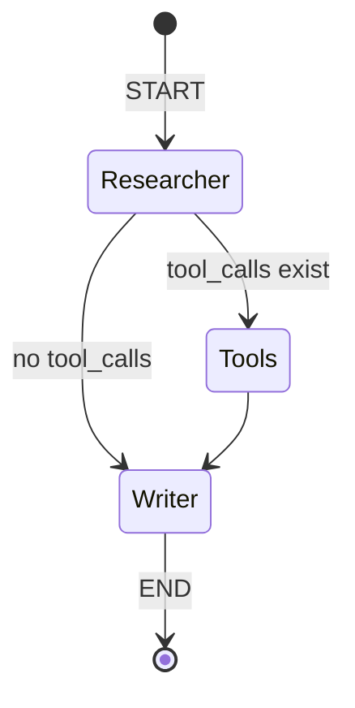
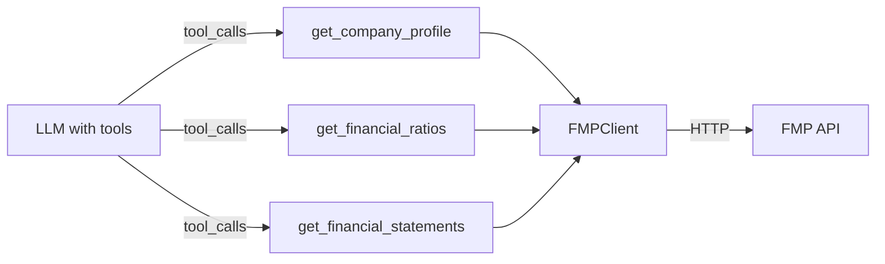
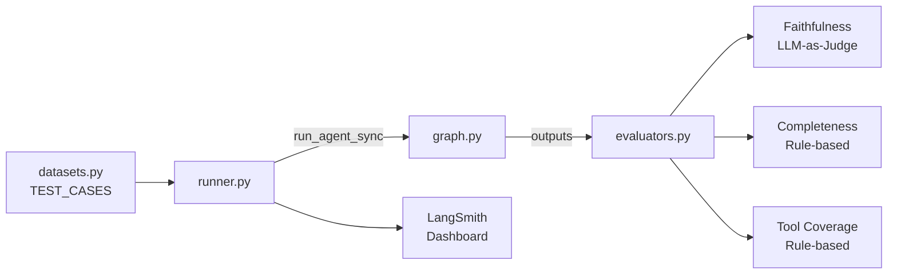
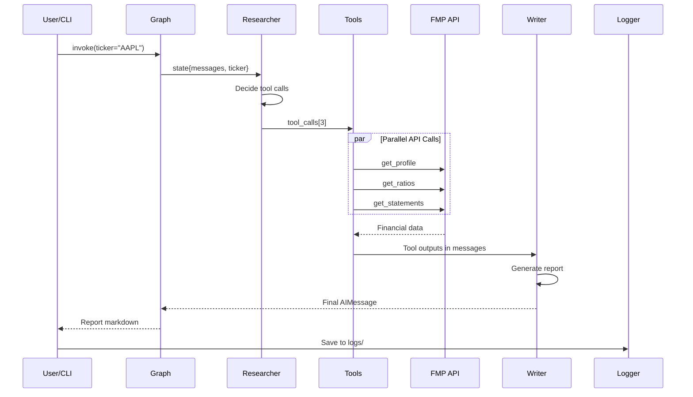

# Financial Agent - System Design

## High-Level Architecture



---

## LangGraph Workflow



| Node | Role | Model |
|------|------|-------|
| **Researcher** | Decide which tools to call | GPT-5-mini (with tools) |
| **Tools** | Execute tool calls | ToolNode (prebuilt) |
| **Writer** | Generate final report | GPT-5-mini (no tools) |

---

## Component Breakdown

### 1. Core Agent (`src/`)

| File | Purpose |
|------|---------|
| `graph.py` | LangGraph workflow definition (nodes, edges, conditions) |
| `state.py` | `AgentState` - holds `messages` + `ticker` |
| `tools.py` | LangChain tools wrapping FMP API calls |
| `client.py` | Async HTTP client for FMP API |
| `utils.py` | `MarkdownLogger` for saving reports |

### 2. Tools Layer



| Tool | Endpoint | Returns |
|------|----------|---------|
| `get_company_profile` | `/profile`, `/quote` | Company info, sector, CEO, market cap |
| `get_financial_ratios` | `/ratios-ttm`, `/key-metrics-ttm` | PE, EPS, ROE, Debt/Equity |
| `get_financial_statements` | `/income-statement`, `/balance-sheet`, `/cash-flow` | 4Y historical financials |

### 3. Evaluation System (`eval/`)



| Evaluator | Method | Checks |
|-----------|--------|--------|
| **Faithfulness** | LLM-as-Judge (GPT-5-mini) | No hallucination, data from tools only |
| **Completeness** | Rule-based | Required sections present |
| **Tool Coverage** | Rule-based | All expected tools called |

---

## Data Flow



---

## Key Design Patterns

| Pattern | Usage |
|---------|-------|
| **State Machine** | LangGraph nodes + conditional edges |
| **Dependency Injection** | Tools bound to LLM at setup |
| **EAFP** | Try API first, handle errors after |
| **Async/Await** | All API calls async, `asyncio.gather` for parallelism |
| **Pydantic Models** | Type-safe API responses |

---

## Directory Structure

```
financial-agent/
├── main.py              # CLI entry point
├── src/
│   ├── graph.py         # LangGraph workflow
│   ├── state.py         # AgentState definition
│   ├── tools.py         # LangChain tools
│   ├── client.py        # FMP API client
│   ├── schemas.py       # Pydantic models
│   └── utils.py         # MarkdownLogger
├── eval/
│   ├── runner.py        # Eval orchestrator
│   ├── datasets.py      # Test cases + LangSmith dataset
│   ├── evaluators.py    # Custom evaluators
│   ├── conftest.py      # Pytest fixtures
│   └── test_eval.py     # Unit tests
└── logs/                # Generated reports
```
